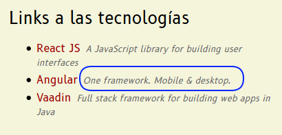
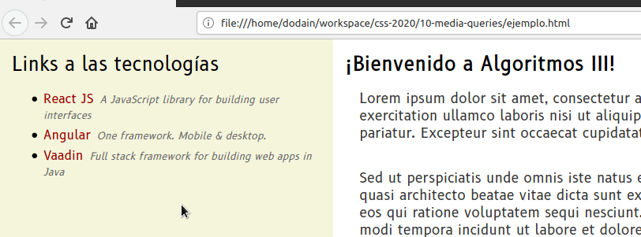
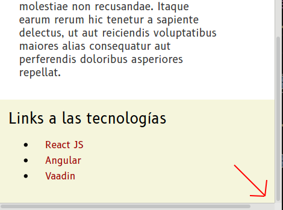

## Media Queries

CSS también permite modificar dinámicamente los estilos en base al tamaño o el tipo de dispositivo en el que estamos mostrando la página, lo que se conoce como **media queries**.

### Sintaxis

Vemos varios ejemplos en archivos de definición css:

```css
@media print { ... } /* páginas en modo de vista previa de impresión */
@media screen { ... } /* pantallas */
@media (min-width: 700px) { ... } /* dispositivos de 700 píxeles de ancho o más */
@media all and (max-width: 500px) { ... } /* todos los dispositivos cuyo ancho sea hasta 500 píxeles */
@media all and (max-width: 1000px) and (min-width: 700px) { .. }
   /* todos los dispositivos que tengan un ancho entre 700 y 1000 píxeles */
```

Para una completa referencia, recomendamos ver [esta página](https://developer.mozilla.org/es/docs/CSS/Media_queries).

## El ejemplo

Presentaremos una página en un navegador de más de 1000 píxeles, en cuyo caso mostrará:

- un menú lateral izquierdo o _sidebar_, con links y una pequeña descripción
- a la derecha, el contenido principal o _content_

Pero si achicamos el tamaño del dispositivo, veremos que desaparecerán las descripciones de los links. El contenido se adapta en base al ancho, si tenemos menos espacio podemos sacar información que no sea relevante.

Por último, pensando en dispositivos móviles cuyo ancho es bastante más restringido (< 500 píxeles), reacomodaremos el layout:

- cuando ya no tengamos espacio suficiente para mostrar el menú y el contenido, primero queremos resaltar el contenido principal
- y luego el _sidebar_ aparecerá abajo, tomando todo el ancho posible y mostrando los links correspondientes.

Vemos una demo:


## Layout general

En el css tenemos las siguientes definiciones:

- un contenedor principal que define ancho y alto al 100%, y un display: flex, con orientación horizontal (el default)
- el container toma el 80%

```css
.main {
  display: flex;
  /* por defecto toma flex-direction: row; */
}

.content {
  width: 80%;
}
```

## Primer media query: agregando la descripción de los links

Si nos fijamos en uno de los links en el archivo `ejemplo.html`, veremos que define un atributo `data-description` de HTML 5:

```html
<a class="sidebar__menu--option" 
   data-description="A JavaScript library for building user interfaces"
   href="https://reactjs.org/">ReactJS
</a>
```

Al agregar un atributo con el prefijo `data-` nos aseguramos que el navegador lo ignora por completo, esto evita errores de parseo pero además le avisa que se trata de un atributo que agrega información semántica, que en este caso va a tomar el media query de css definido para cuando sepamos que el dispositivo ocupa al menos 1001 píxeles:

```css
@media all and (min-width: 1001px) {
  .sidebar__menu--option:after {
    content: attr(data-description);
    font-size: 0.8rem;
    font-style: italic;
    color: var(--color-font-secundario);
    margin-left: 0.5rem;
  }
}
```

Fíjense que la clase de nuestro anchor (`<a>`) es `sidebar__menu--option` siguiendo la [nomenclatura BEM](https://github.com/uqbar-project/css-08-reutilizacion), y lo que estamos haciendo es trabajar con un **selector avanzado**: luego del anchor, pedimos que agregue como contenido html el atributo `data-description` que tenga el link (`content: attr(data-description);`), con un tamaño de 0.8 rem, el color gris y un margen para que no quede tan pegado.



## Pseudo clases

Las pseudoclasses permiten trabajar los diferentes estados de un elemento HTML. Por ejemplo, si queremos resaltar un link cuando el usuario posicione el mouse sobre él, podemos utilizar la pseudo clase :hover

```css
.sidebar__menu--option:hover {
  color: var(--color-link-hover);  
  /* la variable color-link-hover está definida en :root */
}
```

Vemos cómo afecta visualmente a la página:



Otros ejemplos que pueden encontrar en la web serán

- `:hover` sobre un botón
- `:nth-child()` para armar una tabla que diferencie las filas pares e impares
- `:checked` para mejorar el estilo de los checkboxes, cambiándolos por imágenes

Dejamos al final de la página algunos links de referencia para profundizar.

## Cambio de layout para dispositivos móviles

Para que primero aparezca el contenido y luego el menú de links, vamos a pisar nuestro layout default y utilizaremos el flex-direction vertical **en reversa**:

```css
@media (max-width: 500px) {
  .main {
    flex-direction: column-reverse;
    width: 100%;
  }
}
```

Esto hace que los elementos se ordenen en el orden inverso al que los definimos, que es justamente lo que queremos. 

Además vamos a pedirle al sidebar que ocupe un 100% del ancho, pero para que no se pegue tanto el contenido vamos a definirle un padding de 1em. 

```css
@media all and (max-width: 500px) {
  .sidebar {
    width: 100%;
    padding: 1em;
  }
  ...
```

Claro, si recordamos [cómo es el modelo de la caja](https://github.com/uqbar-project/css-02-box-model), si el ancho del sidebar es 100% y le agregamos un padding a izquierda y derecha de 1em eso nos da = 100% + 2em, entonces nos van a aparecer molestas barras de desplazamiento horizontales:



Una solución es cambiar el box-sizing:

```css
@media all and (max-width: 500px) {
  .sidebar {
    width: 100%;
    box-sizing: border-box;  /* fix 1 */
    padding: 1em;
  }
```

Esto hace que desaparezcan las scrollbars. Otra solución que queremos contarles es que podemos hacer cálculos simples en css mediante la función [`calc`](https://developer.mozilla.org/es/docs/Web/CSS/calc):

```css
@media all and (max-width: 500px) {
  .sidebar {
    width: calc(100% - 2em);
    padding: 1em;
  }
  ...
```

Es decir, tomaremos el ancho necesario para que no aparezcan las barras (1em a cada costado suman 2em, eso es lo que le restaremos al valor 100% que dependerá de lo que mida el dispositivo).

## Resumen

Hemos visto en este ejemplo cómo mediante el uso de @media queries podemos hacer ajustes en los dispositivos para mejorar la experiencia de usuario

- agregando o quitando información
- adaptando el layout para que se ajuste mejor a la cantidad de información que puede mostrar

e incluso hemos visto que se pueden lograr efectos visuales mediante el uso de las pseudo clases.

## Material relacionado

- [CSS Media Queries & Using Available Space](https://css-tricks.com/css-media-queries/)
- [Pseudo classes](https://developer.mozilla.org/es/docs/Web/CSS/Pseudo-classes)
- [Understanding Pseudo-Class Selectors](https://hackernoon.com/understanding-pseudo-class-selectors-mg443t89)
- [Meet the Pseudo Class selectors](https://css-tricks.com/pseudo-class-selectors/)
